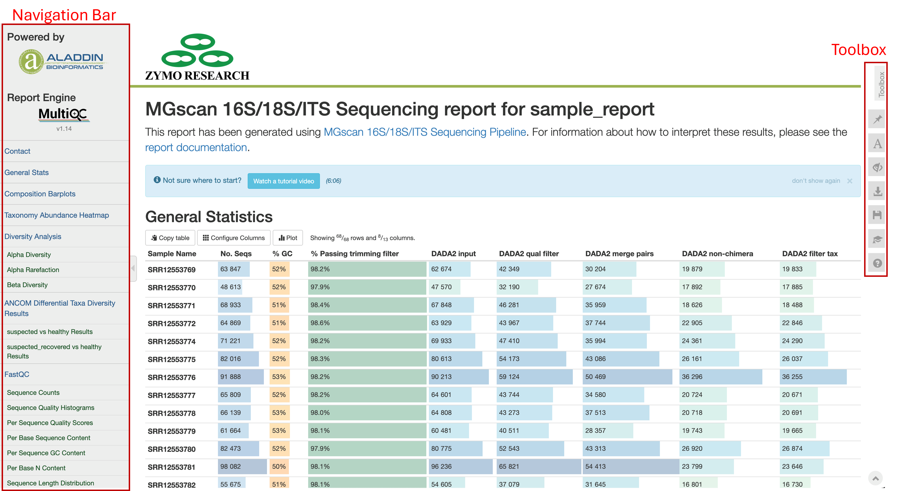
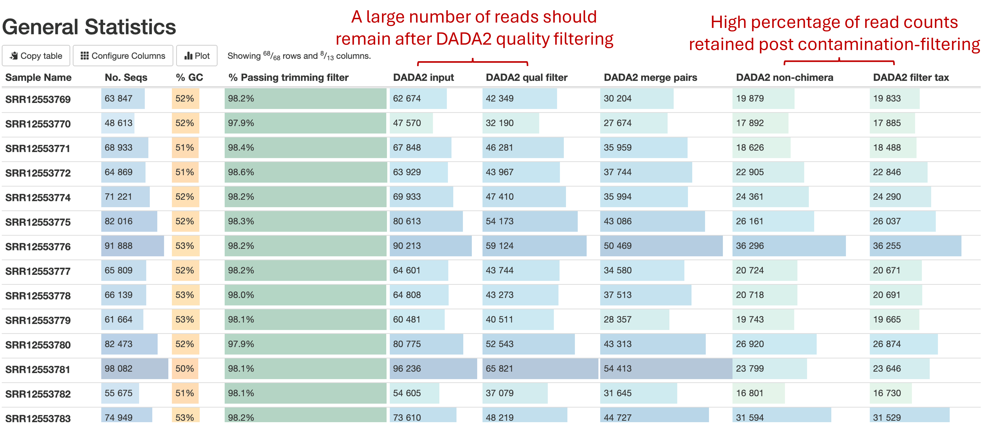
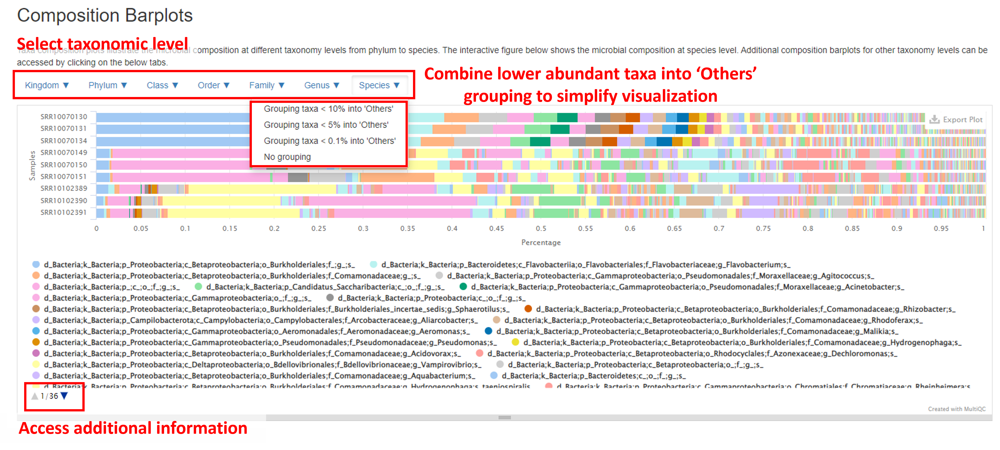
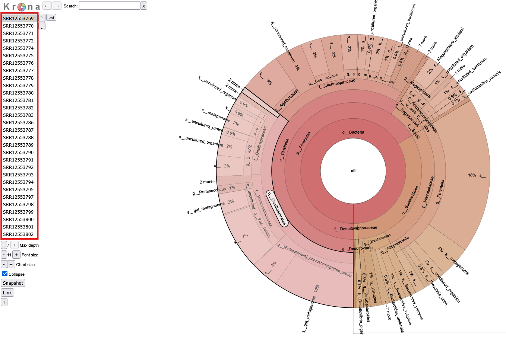
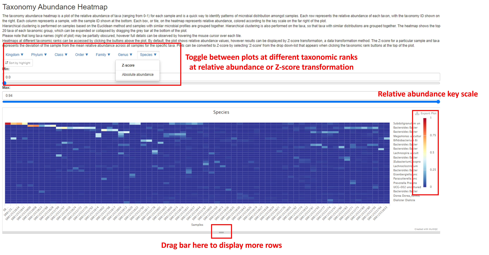
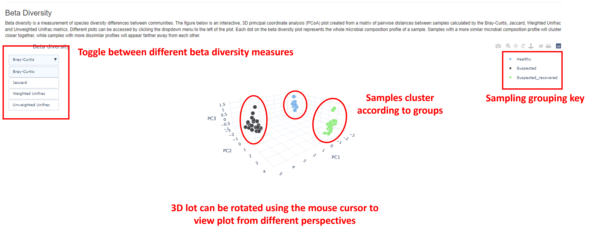
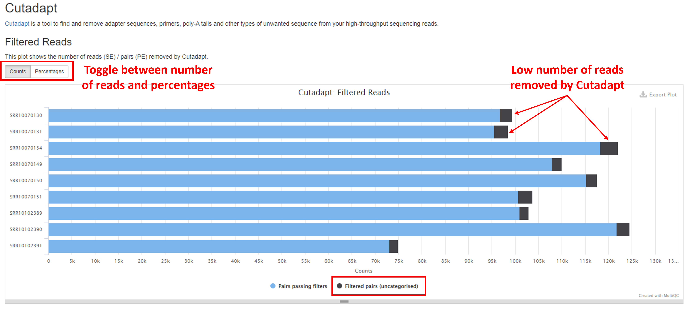

# How to interpret the ampliseq report
This document describes how to understand the bioinformatics report generated by [Aladdin ampliseq pipeline](https://github.com/Zymo-Research/aladdin-ampliseq). Most of the plots are taken from the [sample report](https://zymo-research.github.io/pipeline-resources/reports/ampliseq_sample_report.html). These plots are just an example and may look different in your report.

## Table of contents
* [Table of contents](#table-of-contents)
* [Report overview](#report-overview)
* [General statistics table](#general-statistics-table)
* [Taxonomy classification](#taxonomy-classification)
  * [Composition barplot](#composition-barplot)
  * [Krona plot](#krona-plot)
  * [Taxonomy abundance heatmap](#taxonomy-abundance-heatmap)
* [Diversity analysis](#diversity-analysis)
  * [Alpha rarefaction](#alpha-rarefaction)
  * [Alpha diversity](#alpha-diversity)
  * [Beta diversity](#beta-diversity)
* [Differential abundance analyses](#differential-abundance-analyses)
  * [ANCOM-BC barplot](#ancom-bc-barplot)
* [Sample processing](#sample-processing)
  * [FastQC](#fastqc)
  * [Trimming with Cutadapt](#trimming-with-cutadapt)
* [Software versions](#software-versions)

## Report overview
The bioinformatics report is generated using [`MultiQC`](https://multiqc.info/). There are general instructions on how to use a MultiQC report on [MultiQC website](https://multiqc.info/). The report itself also includes a link to an instructional video at the top of the report. In general, the report has a navigation bar to the left, which allows you to quickly navigate to one of many sections in the report. On the right side, there is a toolbox that enables customization of the report appearance and the export of figures and/or data. Most sections of the report are interactive. The plots will show you the sample name and values when you mouse over them.

## General statistics table
[The general statistics table](https://zymo-research.github.io/pipeline-resources/reports/ampliseq_sample_report.html#general_stats) gives an overview of some important sample information. From left to right, this table contains:
1. The raw number of sequencing reads obtained per sample (`No. Seqs`).
2. The average % GC content of reads (`% GC`).
3. The total percentage of reads passing trimming filters (`% Passing trimming filter`).
4. The number of reads input to DADA2 (`DADA2 Input`).
5. The number of reads passing DADA2 quality filtering `(DADA2 qual filter`)
6. The number of reads after merging of R1 and R2 reads with sufficient overlap (`DADA2 merge pairs`)
7. The number of non-chimeric reads detected (`DADA2 non-chimera`). Chimeric reads are sequencing artifacts resulting from the spurious joining of two or more independent biological sequences, which can be misinterpreted as novel organisms.
8. The number of read counts that were retained following plastid rRNA filtering (`DADA2 filter tax`).

These statistics are collected from different parts of the pipeline workflow to give you a snapshot of the results and are a quick way to evaluate how your ampliseq experiment went. Here are a few important considerations when reading this table:
1. Ensure a high number of reads are retained following Cutadapt and DADA2. A dropout of reads at the Cutadapt trimming step (column DADA2 input) may result from selecting the incorrect sequencing primers at the pipeline run set-up stage. A dropout of reads during DADA2 processing (column DADA2 qual filter, DADA2 merge pairs, DADA2 non-chimera) can result from a high chimera rate (see below) and failure to merge paired-end reads due to insufficient overlap
2. There is a low % chimeric reads retained in DADA2 non-chimera. A high percentage (>5%) of chimeric reads can result from suboptimal PCR reactions when performing mixed template PCR.
3. Few read counts were removed from the ASV table following contamination filtering (column DADA2 filter tax). Removal of a high percentage of read counts at this stage can indicate a high portion of reads amplified plastid sequences (chloroplast and mitochondria) and that your experimental design may need to be revised.

## Taxonomy Classification
### Composition Barplot
The ` Composition Bar Plot` gives a summary of the taxonomic profile of the samples. The Y-axis represents each sample, and the X-axis shows the relative abundance of taxa within each sample. Hovering the mouse cursor over each bar will create a pop out window listing the taxa ID and relative abundance within each sample.
This bar plot contains several features to enhance visualization. The taxonomic rank in taxa are grouped can be selected by clicking the buttons above the bar plot (from Kingdom to Species). To view all taxa present at the taxonomic rank Genus, click on the `Genus` button and select `No grouping`. In the chart below (displayed at the Species level), there are many low abundant taxa, which make the plot difficult to interpret. To simplify this plot, you can click on the `Species` button (or any other taxonomic ranking) and select `Grouping taxa < N% into ‘Others’` to group taxa <0.1%, <5% or <10% abundance into a group called ‘Others’. All taxa below the threshold relative abundance will now appear as one bar, titled ‘Others’. A list of all taxa present can be found under the bar plot, with additional information accessed by clicking the blue arrow at the bottom of the plot.

### Krona Plot
In some cases, numerous taxa identified in one sample can contribute to overcrowding in the composition barplots. If a more detailed format is desired, the pipeline also produces krona reports for each sample. Krona reports display the taxa composition of each sample as a pie chart. Select a sample from the table on the left hand side of the screen. Mouse over a desired taxa and click on the highlighted section to expand it.

### Taxonomy Abundance Heatmap
The `Taxonomy Abundance Heatmap` demonstrates the magnitude of taxa abundance in each sample as a color scale. Each column represents a sample, and each row represents each taxon. The color of each cell (tile) in the heat map represents the relative abundance of each taxa, with the key scale shown on the far right of the plot. The number of rows displayed can be expanded by dragging the bar at the bottom of the plot.
The plot can be toggled between different taxonomic ranks, and between the relative abundance and the Z-score by clicking on the buttons above the plot. The Z-score is a data transformation method often used to visualize gene expression data. Instead of reporting the relative abundance of each taxa, the deviation from the mean relative abundance for all samples for that specific taxa is reported. This can enhance visualization of the heatmap and the ability to spot interesting trends of taxa abundance in the data. The ordering of samples and taxa is determined by hierarchical clustering.
Note that complete taxa name may be obscured from view to the right of the plot, however the complete name can be observed interactively by hovering over each tile in the plot. 

## Diversity Analysis
### Alpha Rarefaction
The first plot in the diversity analysis section shows the rarefaction curves, plotted by metadata grouping (if this information is provided). Rarefaction is a statistical method used to adjust for differences in sequencing library sizes (i.e. uneven numbers of reads) across samples, aiding diversity comparisons. Samples with greater library sizes could demonstrate higher species diversity, simply due to there being higher numbers of microbial reads and not a truly higher diversity, leading us to misinterpret the data. Rarefaction involves randomly subsampling each sample to a specified number of reads, determined by the minimum read count of the sample set, in order to standardize library sizes prior to diversity analyses. 
The rarefaction curve is generated by repeatedly, randomly re-sampling the number of reads for each sample and calculating three alpha diversity metrics at each library size: 
1. `Observed features`, counting the number of different taxa present
2. `Shannon diversity` index, which considers both the number and proportion of taxa 
3. `Faith pd` (Faith’s phylogenetic diversity index), which considers the phylogenetic distance amongst taxa
Rarefaction curves plot the accumulation of species (Y-axis) with increasing sequencing depth (X-axis). Curves should demonstrate a steep initial gradient, which flattens out with increasing sequencing depth, indicating that most of the diversity in the population has been sampled. If the curve fails to plateau, this indicates that a sample has not been sequenced to a sufficient depth to discover all taxa present in the community, as increasing the sequencing depth is still uncovering new taxa. In this case, you may decide to omit these samples from the analyses.

### Alpha Diversity
Alpha diversity describes the species richness within a community. Alpha diversity (following rarefaction) is plotted as a boxplot, in which samples are grouped according to metadata (if this information is provided). Boxplots for four different measures can be visualized by clicking the button in the top left of the plot:
1. `Observed features`, counting the number of different taxa present
2. `Shannon diversity` index, which considers both the number and proportion of taxa 
3. `Faith PD` (Faith’s phylogenetic diversity index), which considers the phylogenetic distance amongst taxa
4. `Evenness`, which considers the distribution of abundance of taxa in a community
Here, you can determine if the species richness differs between your samples, or sample groupings. A greater number of observed features, for example, indicates a greater species richness. You can also hover the mouse cursor over each box to list a range of metrics, including the minimum diversity of samples in a given group (min), max diversity (max), median, 25th percentile (q1) and 75th percentile (q3).  

### Beta Diversity
Whilst alpha diversity measures the species richness in a single sample (or community), beta diversity provides a measure of similarity (or dissimilarity) of microbial compositions between different samples. 
Four different beta diversity statistics are calculated in the report:
1. `Bray-Curtis`. Considers the abundance of taxa shared between two samples and the total number of taxa in each sample when calculating dissimilarity between samples.
2. `Jaccard`. Considers taxa presence/absence, but not abundance.
3. `Weighted Unifrac`. Considers the phylogenetic relationships between taxa found in samples and their relative abundance.
4. `Unweighted Unifrac`. Considers the phylogenetic relationships between taxa found in samples but does not consider their relative abundance.
Following the calculation of beta diversity, a dissimilarity matrix is generated which is visualized as an interactive, 3D principal coordinate plot (PCoA), displaying the first three principal coordinates (PC1-3). Each point in the plot represents a sample. Samples clustered closely together indicate more similar microbial compositions than points which are further apart. 

With this interactive plot, you can toggle between the different beta diversity measures by clicking the button in the top left corner of the plot. The 3D plot can be rotated using the mouse cursor. Viewing the plot from different perspectives can aid in data interpretation.
## Differential abundance analyses
The objective of differential abundance analysis is to identify taxa which differ statistically between samples and sample groups (if this information is provided). The method employed is ANCOM-BC ([Analysis of Compositions of Microbiomes with Bias Correction](https://www.nature.com/articles/s41467-020-17041-7)). ANCOM-BC estimates unknown sampling fractions (ratio of the observed taxa abundance in a sample to its actual abundance in the ecosystem) and uses this estimate to correct for sampling bias through a log-linear regression model. Results can be visualized in the `ANCOM-BC bar plot`.
### ANCOM-BC barplot
In the ANCOM-BC bar plot, the Y-axis represents each taxa and the X-axis represents the log fold change (LFC). Each bar represents the LFC of the absolute abundance of a taxon between treatment groups. Only the top 50 significantly differentially abundant taxa are shown (multiple testing adjusted P value (q value) < 0.05). The second group “Group B” listed in the subheading above each plot in the format of “Group A vs Group B” is the reference group. A positive LFC (LFC > 0) between Group A vs Group B indicates that relative abundance is significantly higher in Group A relative to Group B, whilst a negative LFC (LFC < 0) between Group A vs Group B indicates that relative abundance is significantly lower in group A. For example, in a ‘Treatment-A vs Control’ comparison, a negative LFC for taxa Escherichia coli indicates that the abundance of this taxa is significantly lower in the Treatment-A group relative to the control group (in other words, the abundance of this taxa is higher in the Control group).

## Sample processing
## FastQC
Additional sequencing read quality metrics are provided at the end of the report, performed by the bioinformatic tool [`FastQC`](http://www.bioinformatics.babraham.ac.uk/projects/fastqc/Help/). Here, information on the quality score distribution across reads, per base sequences content (% of bases A, T, C and G) and much more is provided. For further information on these metrics, see the [FastQC help pages]( http://www.bioinformatics.babraham.ac.uk/projects/fastqc/Help/).

### Trimming with Cutadapt
[`Cutadapt`](https://journal.embnet.org/index.php/embnetjournal/article/view/200) is a bioinformatic tool which is used to trim adapter and primer sequences from your raw sequence reads. The bar plot in the `Filtered Reads` section of the report shows the numbers/percentages of reads that were retained following adapter and primer removal (buttons in the top left will toggle between these two metrics). A good sample should retain the majority of reads (“Pairs passing filters”) following `Cutadapt` filtering (<5% reads removed). A high percentage of reads dropped may indicate errors in upstream library preparation. The `Trimmed Sequence Lengths` section shows numbers of reads with certain lengths of adapters trimmed.

Additional `FastQC` summary statistics are shown at the end of the report.

## Software Versions
This section lists the versions of software used in this bioinformatic pipeline. This should help you in writing the methods section of your publication or if you wish to carry out some of the analysis on your own.
