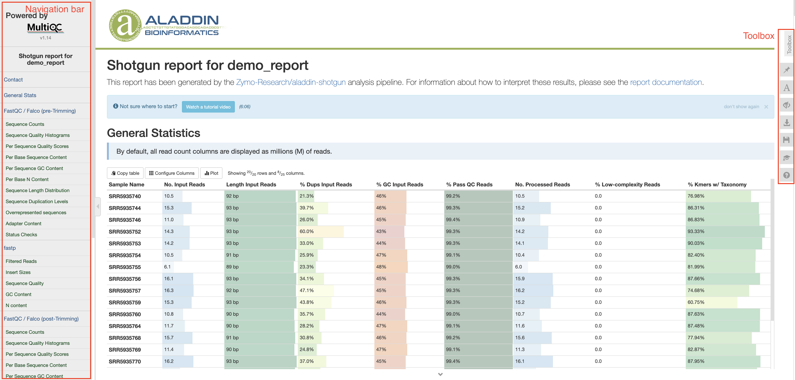

# How to interpret the shotgun report
This document describes how to understand the bioinformatics report generated by [Aladdin shotgun pipeline](https://github.com/Zymo-Research/aladdin-shotgun). Most of the plots are taken from the [sample report](https://zymo-research.github.io/pipeline-resources/reports/shotgun_sample_report.html). The sample report was generated using a small number of samples from [this paper](https://pubmed.ncbi.nlm.nih.gov/35614211). The plots in your report might look a little different.

## Table of contents
* [Table of contents](#table-of-contents)
* [Report overview](#report-overview)
* [General statistics table](#general-statistics-table)
* [Sample processing](#sample-processing)
  * [FastQC/Falco](#fastqc/falco)
  * [fastp](#fastp)
  * [BBDuk](#bbduk)
  * [Kmer composition](#kmer-composition-sourmash)
  * [Qiime composition barplot](#qiime-composition-barplot)
* [Diversity analysis](#diversity-analysis)
  * [Alpha diversity](#alpha-diversity)
  * [Alpha rarefaction](#alpha-rarefaction)
  * [Beta diversity](#beta-diversity)
* [Comparative diversity analysis](#comparative-diversity-analysis)
  * [Alpha diversity compared with reference](#alpha-diversity-compared-with-reference)
  * [Beta diversity compared with reference](#beta-diversity-compared-with-reference)
* [Pipeline information](#pipeline-information)
  * [Software versions](#software-versions)
  * [Workflow summary](#workflow-summary)

## Report overview
The bioinformatics report is generated using [`MultiQC`](https://multiqc.info/). There are general instructions on how to use a MultiQC report on [MultiQC website](https://multiqc.info/). The report itself also includes a link to a instructional video at the top of the report. In general, the report has a navigation bar to the left, which allows you to quickly navigate to one of many sections in the report. On the right side, there is a toolbox that allows to customize the appearance of your report and export figures and/or data. Most sections of the report are interactive. The plots will show you the sample name and values when you mouse over them.

## General statistics table
[The general statistics table](https://zymo-research.github.io/pipeline-resources/reports/shotgun_sample_report.html#general_stats) gives an overview of some important stats of your samples. 

## Sample processing

### FastQC/Falco

### fastp

### BBDuk

### Kmer composition (sourmash)

### Qiime composition barplot

## Diversity analysis

### Alpha diversity

### Alpha rarefaction

### Beta Diversity

## Comparative diversity analysis

### Alpha diversity compared with reference

### Beta diversity compared with reference

## Pipeline information

### Software versions

### Workflow summary